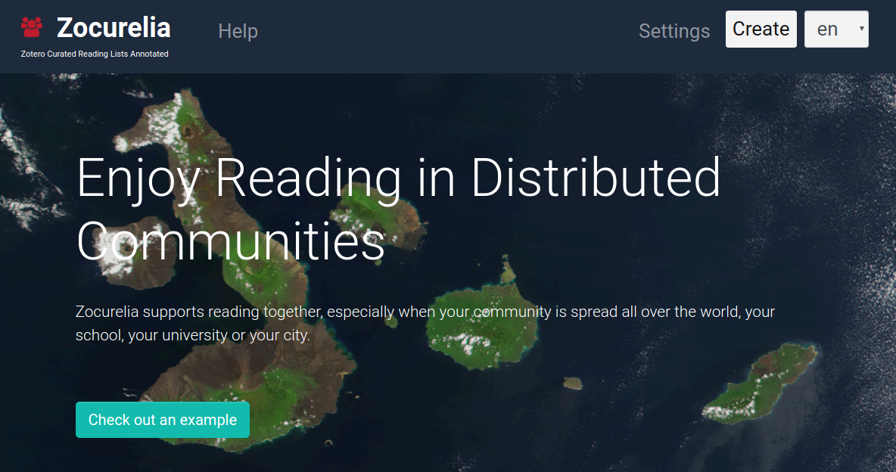

# Zocurelia

[](https://doi.org/10.5281/zenodo.3687258)

Zocurelia supports reading together, especially when your community is spread all over the world, your school, your university or your city.



Zocurelia is short for **Zo**tero **cu**rated **re**ading **li**sts **a**nnotated. It integrates the features of Zotero and Hypothesis seamlessly. With a Zocurelia list you can show the Hypothesis activity for each text on a Zotero reading list.

## For developers

### Project setup
```
yarn install
```

#### Compiles and hot-reloads for development
```
yarn run serve
```

#### Compiles and minifies for production
```
yarn run build
```

#### Run your tests
```
yarn run test
```

#### Lints and fixes files
```
yarn run lint
```

#### Customize configuration
See [Configuration Reference](https://cli.vuejs.org/config/).

## License

&copy; 2019 Axel Dürkop | [MIT License](LICENSE)